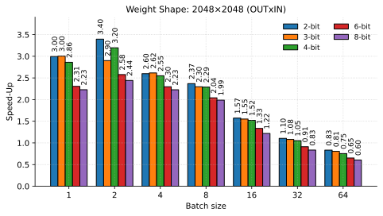
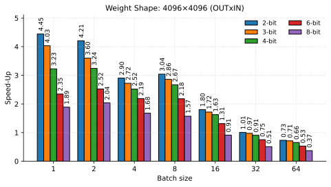
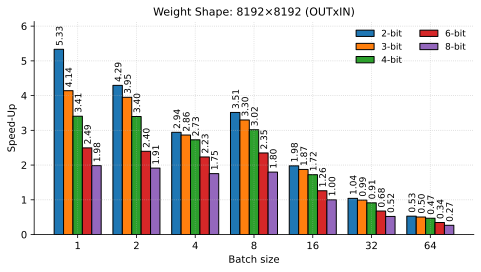
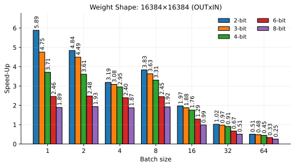
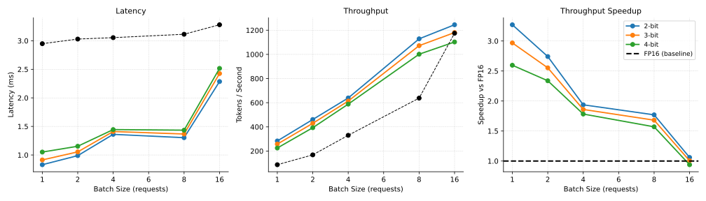

# Efficient MatGPTQ Inference Kernel 

We additionally provide a **custom CUDA kernel** optimized for **low-batch matrix-matrix multiplication latency** with support for **nested 2-8 bit quantization**. The implementation targets **Ampere GPUs** and can be extended to Hopper (similar in spirit to how Marlin $\rightarrow$ Machete evolved).

The kernel performs **on-the-fly dequantization** of weights:

* Quantized weights: $W_Q$
* Dequantized weights: $W_D$ 
* Input activations: $X$ (FP16)
* Accumulator: FP32

The computation performed is:

$$
\mathbf{Y} = \mathbf{X} W_D,
$$

but for improved TensorCore utilization in the low-batch regime we execute:

$$
\mathbf{Y} = \left( W_D^T \mathbf{X}^T \right)^T.
$$

This layout deviates slightly from the `torch.nn.Linear` convention, enabling more efficient TensorCore scheduling when the batch dimension is small.

## Installation

To install the kernel run the following command (from the root directory):

```bash
uv pip install --no-build-isolation -e . 
```


## Running Tests

To verify correctness of the kernel, run:

```bash
python test_matgptq_matmul.py
```

This should validate the kernel for float16 and bfloat16, all supported bitwidths (2, 3, 4, 6, 8) for a variety of input dimensions.

## Running Benchmarks

### Kernel Benchmark

To measure throughput of the kernels as reported use:

```bash
python bench_matgptq_matmul.py --n_out_features 2048 --n_in_features 2048
python bench_matgptq_matmul.py --n_out_features 4096 --n_in_features 4096
python bench_matgptq_matmul.py --n_out_features 8192 --n_in_features 8192
python bench_matgptq_matmul.py --n_out_features 16384 --n_in_features 16384
```

The results can be seen below:

<div class="row"><center>
  <div class="column">
    
    
  </div>
 </center>
</div>
</br>
<div class="row"><center>
  <div class="column">
    
    
  </div>
  <em>Benchmark results comparison across muliple matrix dimensions with torch.matmul as the baseline. Our kernels achieve speedups between 3x and 5.6x in the memory-bound regime.</em>
 </center>
</div>

### End-to-End Benchmarks

To run end-to-end benchmarks using the transformer library see `scripts/run_bench_e2e.sh` for an example. Use the respective model and adapt the slice bit-width as needed.

```bash
bash scripts/run_bench_e2e.sh
```

To evaluate vLLM throughput, we integrated `vllm_matgptq.py` into vLLM and run following benchmark commands. Adapt the bit-width (per config) and batch-size (`--max-num-seqs`) as needed:

```bash
vllm bench throughput \ 
    --model $MODEL_ID$ \ 
    --tokenizer $MODEL_ID$ \ 
    --num-prompts 128 \ 
    --max-num-seqs 1 \ 
    --input-len 32 \ 
    --random-input-len 32 \ 
    --output-len 128 \ 
    --random-output-len 128
```

To evaluate vLLM latency, we integrated `vllm_matgptq.py` into vLLM and run following benchmark commands. Adapt the bit-width (per config) and batch-size (`--batch-size`) as needed:

```bash
vllm bench throughput \ 
    --model $MODEL_ID$ \ 
    --tokenizer $MODEL_ID$ \ 
    --seed 0 \ 
    --batch-size 1 \ 
    --input-len 32 \ 
    --output-len 128
```

Results can be seen below:

<div class="row">
<center>
    
    <em>End-to-end speedups in vLLM (Kwon et al., 2023) for Llama-3.1-8B-Instruct. Our kernels achieve speedups between 1.5x and 3.5x in the memory-bound regime. We evaluated on an RTX A6000 using Prompt/Decode 32/128</em>
</center>
</div>


## Deployment

To deploy MatGPTQ models into various environment, you can use MatGPTQ with our vLLM plugin as followed (more information [here](https://docs.vllm.ai/en/latest/features/quantization/)). We recommend to use a clean and new environment (tested with vllm>=0.14.0):

```python
import vllm_matgptq
from vllm import LLM

llm = LLM(model="your-model", quantization="my_quant")
```

See `ìnference_demo_vllm.py` as an example on how to implement it. To run the model see `scripts/run_inference_vllm.sh` for an example.

```bash
bash scripts/run_inference_vllm.sh
```

### Transformers

Furthermore, we provide a integration in Transformers. See `ìnference_demo_transformers.py` as an example on how to implement it. To run the model via transformers library see `scripts/run_inference_transformers.sh` for an example.

```bash
bash scripts/run_inference_transformers.sh
```

